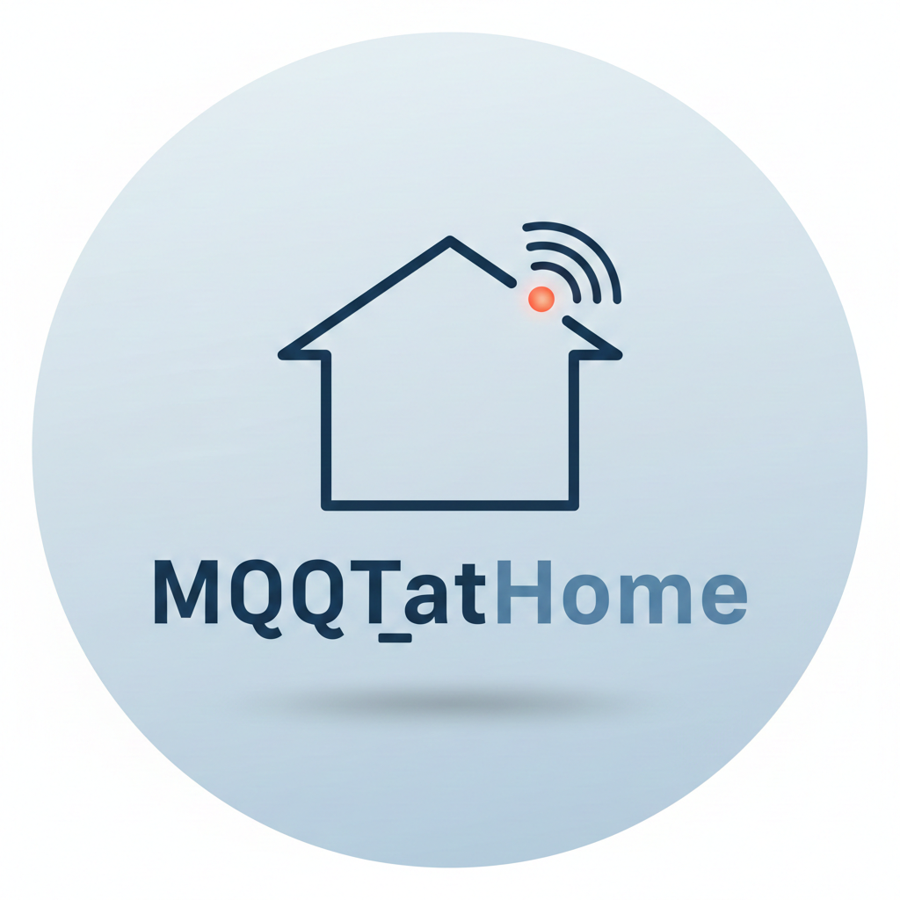
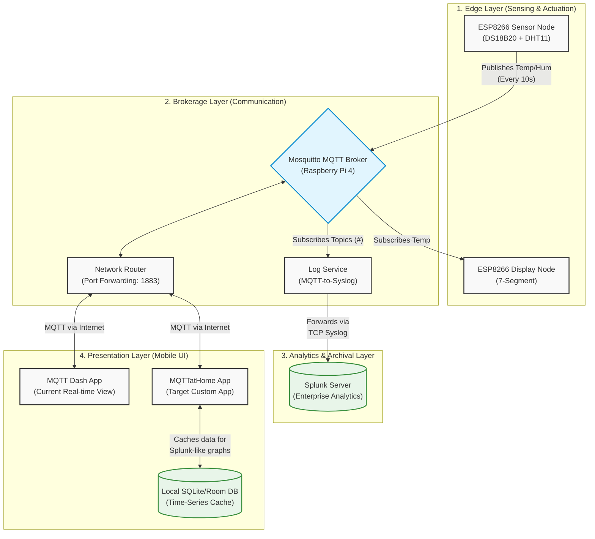

# MQTTatHome 🏠📶

**MQTTatHome** is a custom IoT telemetry and monitoring system designed to track residential environmental data. It bridges the gap between simple real-time IoT sensors and enterprise-grade data visualization by bringing Splunk-like historical graphing directly to a native Android application.

  

## 📖 Table of Contents
* [About the Project](#about-the-project)
* [System Architecture](#system-architecture)
* [Hardware & Software Stack](#hardware--software-stack)
* [The Mobile App (Target Solution)](#the-mobile-app-target-solution)
* [Future Roadmap](#future-roadmap)

---

## 🚀 About the Project
Many smart home setups excel at showing *current* data, but fail to provide historical context without complex external dashboards. This project utilizes a Publish-Subscribe (Pub/Sub) model via MQTT to decouple data acquisition from visualization. 

While enterprise logs are routed to **Splunk** via Syslog for heavy analysis, the **MQTTatHome Android App** will cache incoming telemetry locally, allowing for instant, beautiful historical graphs directly on a smartphone.

---

## 🏗️ System Architecture

The system is divided into four logical layers: Sensing (Edge), Communication (Broker), Analytics (Splunk), and Presentation (Mobile).

> **Note:** The architecture relies on an ESP8266 to collect shower water temperature and ambient weather data, which is broadcasted to a central Mosquitto broker on a Raspberry Pi.

  

---

## 🧰 Hardware & Software Stack

### Edge / Hardware
* **Microcontrollers:** ESP8266 (NodeMCU/Wemos D1)
* **Sensors:** * `DS18B20` (Waterproof probe for shower temperature)
  * `DHT11` (Ambient outdoor temperature and humidity)
* **Actuators:** 7-Segment Display (Driven by a dedicated ESP8266 subscriber)

### Broker & Backend
* **Server:** Raspberry Pi 4 Model B
* **MQTT Broker:** Eclipse Mosquitto
* **Analytics:** Splunk Enterprise (Ingesting data via TCP Syslog)

### Mobile Application
* **Language:** Kotlin
* **Libraries:** Eclipse Paho (MQTT client), MPAndroidChart (Graphing), Room/SQLite (Local persistence)

---

## 📱 The Mobile App (Target Solution)
Currently, system data is viewable via the third-party *MQTT Dash* app for real-time inspection. 

The **MQTTatHome Custom App** is being developed to solve the "transient data" problem of MQTT. By implementing a local SQLite/Room database on the device, the app will listen to the broker in the background (or sync upon opening) and store time-series data. This allows the app to render 1-hour, 24-hour, and 7-day historical graphs mimicking the Splunk dashboard experience.

---

## 🗺️ Future Roadmap
- [ ] **Phase 1:** Core Android App UI and MQTT connection.
- [ ] **Phase 2:** Local data persistence (Room Database) for historical graphing.
- [ ] **Phase 3:** Push notifications for specific temperature thresholds.
- [ ] **Phase 4 (Security Hardening):** Migrate from standard MQTT (Port 1883) to MQTTS (TLS/SSL on Port 8883) with strict User/Password authentication and ACLs. *(Note: May require upgrading Edge nodes to ESP32 for cryptographic performance).*

---
*Developed by [@ruimmpires](https://github.com/ruimmpires)*
